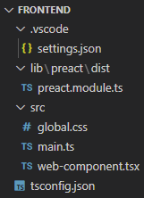
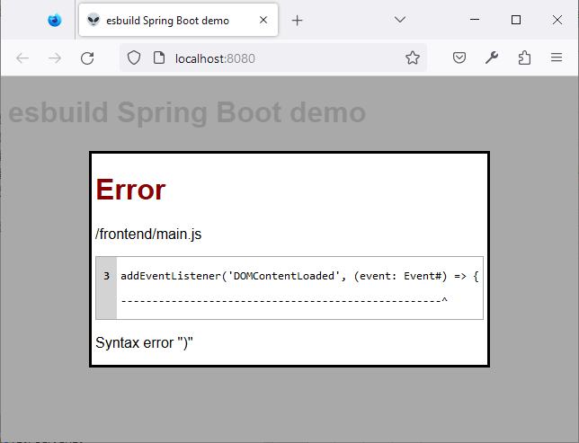
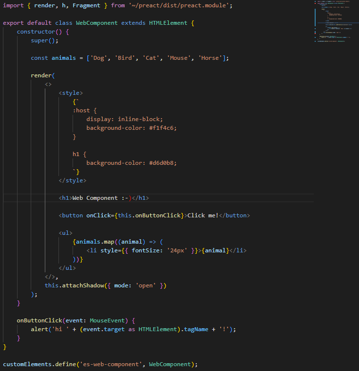

# esbuild-java-spring-boot

This repository contains multiple projects to make the power of [esbuild](https://esbuild.github.io/) available for a Java Spring Boot development.
The dev-server uses esbuild mainly to strip-off the TypeScript type information.
That means no type checking is performed at all.
The type checking is done at development time in Visual Studio Code.
When the [Visual Studio Code Prettier extension](https://marketplace.visualstudio.com/items?itemName=esbenp.prettier-vscode) is installed the TypeScript code is also formatted on save.

This approach targets only modern browsers because they need to support `esnext` JavaScript features.
There is also no bundling involved.
For production HTTP caching is used to mitigate the negative effect of many small files.

The goal is an as-integrated-as-possible development experience.
That means no fiddling with npm and no separate dev-server with its own log to watch.

## esbuild-java-bindings

```xml
<dependency>
	<groupId>com.scheible.esbuild</groupId>
	<artifactId>esbuild-java-bindings</artifactId>
	<version>0.2.3</version>
</dependency>
```

Implementation of the [esbuild binary protocol](https://github.com/evanw/esbuild/blob/main/lib/shared/stdio_protocol.ts).
Allows to spawn an esbuild process and use it from Java.
Currently protocol support is limited to only `TransformRequest` and `TransformResponse`.

**Note**: This library includes a copy of [esbuild](https://github.com/evanw/esbuild) (MIT license). The binaries were downloaded like described in [Other ways to install](https://esbuild.github.io/getting-started/#other-ways-to-install). Currently Linux and Windows on x64 are supported (support for more operating systems and architectures can be added in the `Executable` class).

## esbuild-spring-devserver

A dev-server that uses esbuild to transform `.ts` and `.tsx` files to JavaScript on-the-fly.
Directory structure of project is opinionated: `./src/main/frontend` has to contain the `tsconfig.json` and a `src` directory with the TypeScript files and static resources.
The `lib` directory contains stubs for [WebJars](https://www.baeldung.com/maven-webjars) that are available in the web app.



The core of the dev-server is the `EsBuildFilter`.
esbuild errors are displayed as an nice overlay in the browser:



The `import` statements of the TypeScript files are resolved by a dynamically created [import map](https://www.digitalocean.com/community/tutorials/how-to-dynamically-import-javascript-with-import-maps).

The used esbuild version can be dynamically upgraded by placing the binaries in `./src/main/resources` (naming like in esbuild-java-bindings project) and setting the property `esbuild-spring-devserver.esbuild-version` of the Spring Boot application.

## esbuild-maven-plugin

```xml
<dependency>
	<groupId>com.scheible.esbuild</groupId>
	<artifactId>esbuild-maven-plugin</artifactId>
	<version>0.1.4</version>
</dependency>
```

A simplistic Maven plugin to transform all `.ts` and `.tsx` files to JavaScript.
Also a static import map for all `.ts` and `.tsx` files is generated.
All other file types are just copied.
Default target directory is `./target/classes/static/frontend`.
The goal can be run with `com.scheible.esbuild:esbuild-maven-plugin:prepare-frontend`.

The used esbuild version can be dynamically upgraded by placing the binaries in `./src/main/resources` (naming like in esbuild-java-bindings project) and setting the configuration property `<esBuildVersion>` of the Maven plugin.

## esbuild-devserver-spring-boot-starter

```xml
<dependency>
	<groupId>com.scheible.esbuild</groupId>
	<artifactId>esbuild-devserver-spring-boot-starter</artifactId>
	<version>0.1.4</version>
</dependency>
```

Spring Boot starter to enable the dev-server without any needed for additional configuration.
The dev-server is only available when `spring-boot-devtools` is on the classpath.
For production the esbuild-maven-plugin has to be used.
esbuild is not needed anymore then.
The only thing that remains is a static import map generated by esbuild-maven-plugin.

## esbuild-spring-boot-demo

Demo app for the esbuild dev-server and the Maven plugin.
Showcases a `.ts` and a `.tsx` file with a [Web Component](https://developer.mozilla.org/en-US/docs/Web/Web_Components).
The `JSX` rendering in the Web Component is done with [preact](https://preactjs.com/).

**Note**: The demo app contains [this favicon](https://favicon.io/emoji-favicons/alien/) (CC-BY 4.0. license).

### Backend

The demo app uses [Thymeleaf](https://www.thymeleaf.org/) for template rendering.
But any templating engine can be used.
It only has to append the `rev` query parameter and render the import map.
In the case of the demo app the end result looks then like this:

```html
<!DOCTYPE html>
<html lang="en">
	<head>
		<meta charset="utf-8" />
		<link rel="icon" type="image/x-icon" href="/favicon.ico" />

		<title>esbuild Spring Boot demo</title>

		<script type="importmap">
			{
				"imports": {
					"~/main": "/frontend/main.js?rev=6c4f330",
					"~/web-component": "/frontend/web-component.js?rev=6c4f330",
					"~/preact/dist/preact.module": "/webjars/preact/dist/preact.module.js?rev=6c4f330"
				}
			}
		</script>

		<script type="module" src="/frontend/main.js?rev=6c4f330"></script>
		<link rel="stylesheet" type="text/css" href="/frontend/global.css?rev=6c4f330" />
	</head>
	<body>
		<h1>esbuild Spring Boot demo</h1>
	</body>
</html>
```

In the corresponding Java code the model attributes have to be set:

```java
model.addAttribute("appRevision", this.appRevision.value());
model.addAttribute("importMap", this.importMapGenerator.generate(Map.of( //
		ImportMapper.FRONTEND_PREFIX_PLACEHOLDER, this.servletContext.getContextPath() + "/frontend", //
		ImportMapper.LIBRARY_PREFIX_PLACEHOLDER, this.servletContext.getContextPath() + "/webjars", //
		ImportMapper.APP_REVISION_PLACEHOLDER, this.appRevision.value())));
```

`AppRevision` and `ImportMapGenerator` are beans made available by the esbuild-devserver-spring-boot-starter.

Frontend

The following source shows the `.tsx` file with the Web Component.
preact has to be imported for rendering the `TSX` code.
Types can be used as usual.
A example is the `Event` type of the `onButtonClick` function.


